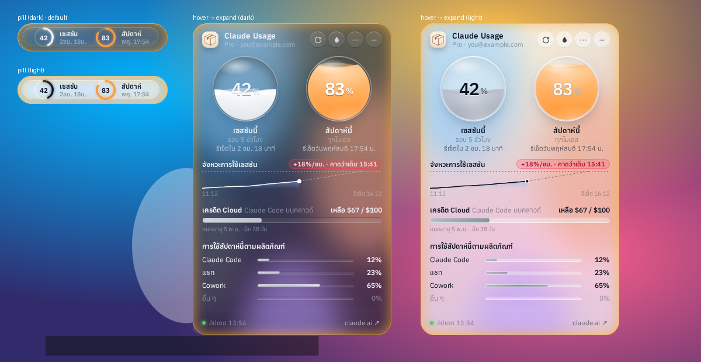

# Claude Usage Widget

A small **Liquid Glass** desktop widget for **Windows** that shows your **claude.ai plan usage**: the 5-hour session limit, the weekly limit, and per-model weekly limits when your plan has them. It shows how much of each you've used and when each one resets.

วิดเจ็ตหน้าจอสำหรับ Windows ธีม Liquid Glass แสดง % การใช้งานแพลน claude.ai (เซสชัน 5 ชม. / รายสัปดาห์) พร้อมเวลารีเซ็ต



> ⚠️ **Unofficial.** This project is not affiliated with or endorsed by Anthropic. It reads the same usage data that claude.ai shows on its own settings page, through an undocumented endpoint. That endpoint may change at any time, and if it does, the widget can stop working.

---

## Smooth folding (2.4)

When you collapse or expand the widget, the window resize itself is the animation. The panel is already laid out in its final form, and the window grows to reveal it or shrinks to clip it, anchored to the nearest screen edge. The window moves along a time-based ease curve, so late timer ticks never make it stutter. Sliding into and out of a screen edge uses the same smooth motion.

## Performance (2.3)

All ambient animations are compositor-only, so they don't repaint. In testing, idle repaints fell from about 360/s to almost 0, and main-thread time fell from about 6.5% to 0.1%. **Reduce animations** in the tray stops the waves and glow completely.

## What's new in 2.0

- **Monochrome by default.** Rings and liquid are white/grey (following light/dark mode) while usage is under 50%. They turn yellow → orange → red only as you approach a limit.
- **Soft breathing alert.** Above 80% the frame glows slowly amber (red above 90%). There is no blinking and no pop-ups.
- **Magnetic snap.** When you drop the widget near a screen edge, it snaps to that edge.
- **Hide in the edge (optional).** A widget snapped to the left or right edge slides away when you're not using it, leaving a thin handle. It slides back out when your mouse touches the handle.
- **Ghost mode.** The widget becomes click-through, so you can click whatever is behind it. Hold **Ctrl** to use the widget normally while in ghost mode. Toggle ghost mode with `Ctrl+Alt+G`.
- **Adaptive opacity.** When the mouse is far away, the widget fades to 20/30/50% (your choice) and comes back instantly as the cursor approaches. Animations pause while it's faded or hidden to save battery.
- **Smooth values.** Numbers and rings glide to each new value using requestAnimationFrame interpolation, instead of jumping on every refresh.

## Download / ดาวน์โหลด

Get the latest build from **[Releases](../../releases/latest)**:

| File | Use |
|---|---|
| `ClaudeUsageWidget-Setup-x.y.z.exe` | Installer. Adds Start Menu and Desktop shortcuts. |
| `ClaudeUsageWidget-Portable-x.y.z.exe` | Portable build. Runs without installing. |

The builds are not code-signed, so Windows SmartScreen may show a warning. To continue, click **More info → Run anyway**.

ไฟล์ยังไม่ได้เซ็นลายเซ็นดิจิทัล ถ้า SmartScreen เตือนให้กด **More info → Run anyway**

## Requirements

- Windows 10 or 11 (64-bit)
- A claude.ai account on a Pro, Max, Team or Enterprise plan
- For the blurred **Acrylic** glass effect: Windows 11 22H2 or later. On older systems, choose **Clear Glass** from the tray menu.

## Sign in / การเข้าสู่ระบบ

1. Click **ล็อกอินด้วยอีเมล** (Sign in with email). Enter your email and complete the claude.ai sign-in with the code or link it sends you.
   - Google blocks sign-in inside embedded app windows, so the Google button will not work here. If your account uses Google sign-in, enter the same email address instead; this works.
   - If claude.ai emails you a link, right-click it, choose **Copy link**, and paste it into the box shown at the bottom of the sign-in window.
2. **Alternative:** Sign in to claude.ai in your normal browser. Then open DevTools (F12) → **Application** → **Cookies** → `https://claude.ai`, copy the value of `sessionKey`, and click **วางจากคลิปบอร์ด** (Paste from clipboard) in the widget.

Your session is stored **only on your PC**, in the app's own browser profile. It is never sent anywhere except `claude.ai`.

## Features

- Liquid-glass orbs whose fill level shows usage. The colour changes from blue to amber to red as you get close to a limit.
- A countdown to each reset, in Thai.
- **This week's usage by product** (Claude Code / Chats / Cowork / Other), read from your claude.ai usage page. It refreshes every 10 minutes, or right away when you press refresh.
- Per-model weekly limits (Opus, Sonnet) appear when claude.ai reports them for your plan.
- Claude Code cloud-session credits (the `iguana_necktie` field in the API) are shown as dollars remaining, with the expiry date.
- Limits that claude.ai returns under unannounced internal codenames (e.g. `nimbus_quill`) are not shown.
- Tray menu with these settings:
  - Always on top
  - Start with Windows
  - Refresh interval (1, 2, 5 or 10 min)
  - Notifications at 80% and 95%
  - Glass material: Acrylic, Mica or Clear
  - Font: Anuphan, IBM Plex Sans Thai, Prompt or Noto Sans Thai, all bundled with the app
  - Organization switcher, if you belong to more than one
- Colours are customisable from the droplet button, with separate settings for the **liquid** and the **glass**:
  - Liquid: **By level** (blue → amber → red, the default), **Single colour** (7 presets or any custom colour), or **RGB** (a rainbow cycle)
  - Glass: **Clear** (truly clear, with no tint and no blur; only the rim and highlights remain), **Frosted** (blurred Acrylic, the default), **Tinted** (a Liquid Glass-style colour tint with adjustable strength), or **RGB** (a soft, blurred rainbow light moving inside the glass)
  - An optional red warning above 90% usage
- **Collapse** the details with the arrow under the orbs. Collapsed, the widget is just the two orbs; the arrow shows your remaining cloud credit.
- **Session pace**: a sparkline of the current 5-hour window and your burn rate (%/hour). It also tells you whether you'll hit the limit before the reset (e.g. "expected full at 15:07").
- **Pixel cats 🐾** that wander along the bottom of the glass. There are six of them: a walker, a sitter that hops around, a yarn player, a reader, a sleeper with little *z*s, and a fish-chasing sprinter. Click one and it meows. You can also add your own pet from any transparent PNG/GIF/WEBP. The cats are built to be light: there is no per-frame JavaScript, since each cat decides what to do on a timer every few seconds, and all motion is compositor-only CSS transforms. They are fully paused while the widget is a pill, faded, or hidden. In testing, six cats added about 1% main-thread time.
- **Header icon**: the box, a sparkle, or any image you pick (PNG/JPG/SVG/ICO, up to 2 MB), set from the tray.
- **Widget size**: 75% / 85% / 100% / 115%, set from the tray.
- **Tray icon** shows your session % as a small coloured ring.
- **Global shortcut** `Ctrl+Alt+C` shows or hides the widget.
- **Lock position**, so the widget can't be dragged by accident.
- A notification when your 5-hour session resets, plus a red pulse on an orb that is above 90%.
- Click a liquid orb to make it slosh, bubble and splash. Poke it a few times fast and see what happens.
- Follows the Windows light/dark theme.
- Remembers where you placed it on screen.


## Build from source

```bash
npm install
npm start          # run in development
npm run dist       # build installer + portable exe into dist/
```

Pushing a tag like `v1.2.0` makes GitHub Actions (`.github/workflows/release.yml`) build both `.exe` files on Windows and attach them to a new Release.

## How it works

- Built with Electron. The widget window is frameless and uses Windows 11's `backgroundMaterial` (Acrylic or Mica) for the real desktop blur. CSS then adds the tint, rim light, specular sheen and the liquid gauges.
- Usage data is fetched from inside a hidden `claude.ai` page that uses your signed-in session:
  - `GET /api/organizations`
  - `GET /api/organizations/{id}/usage`
- The per-product breakdown has no API. The widget loads `claude.ai/settings/usage` in a hidden window (at most every 10 minutes) and reads the "usage by product" section from the page.
- Only known limit types are shown. Internal codename fields are ignored.

## Fonts

The bundled fonts are Anuphan, IBM Plex Sans Thai, Prompt and Noto Sans Thai, taken from [Fontsource](https://fontsource.org). All four are licensed under the SIL Open Font License 1.1.

## License

MIT © Pack
