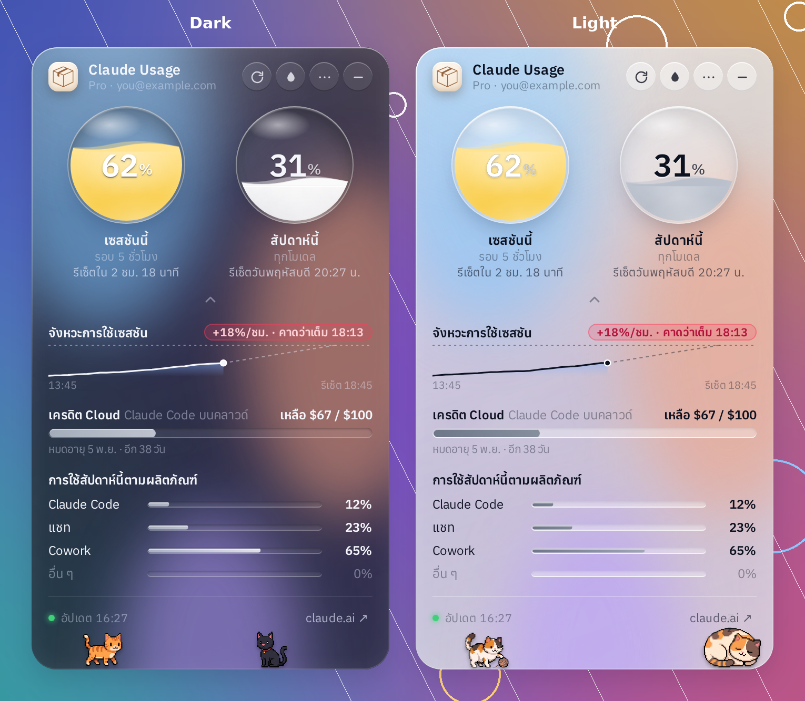
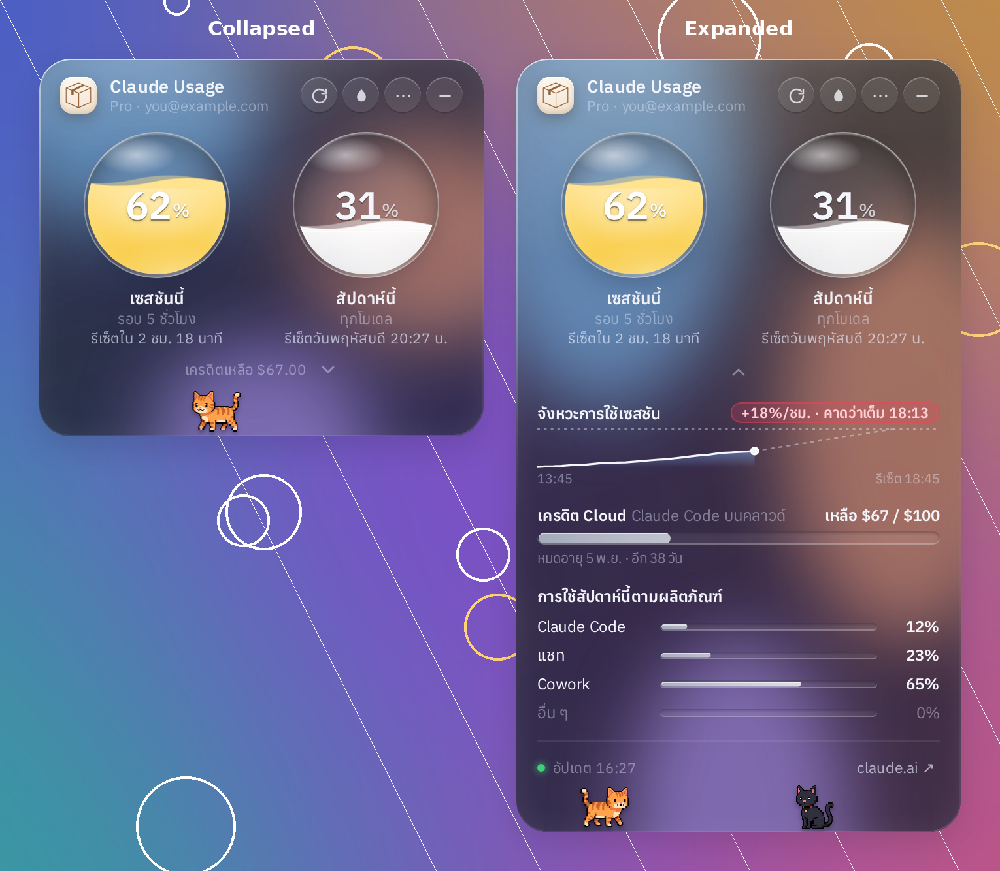
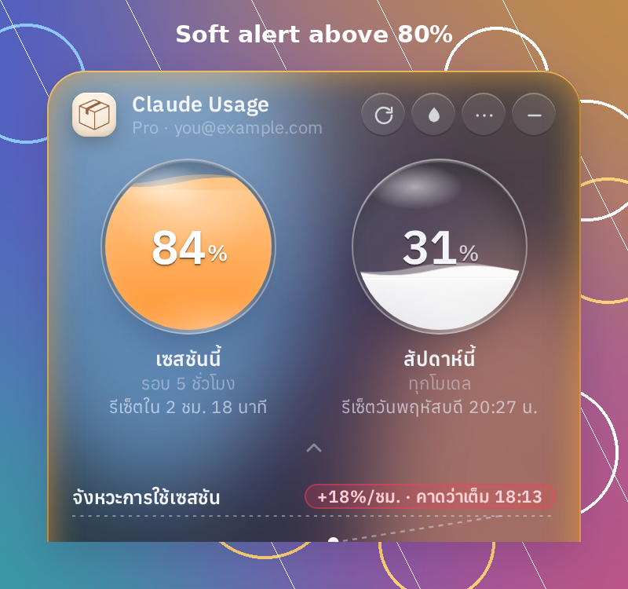
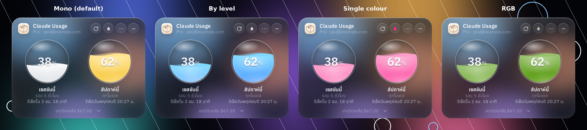
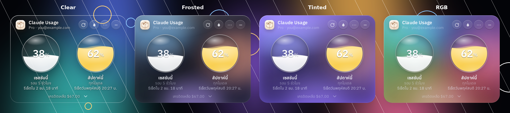
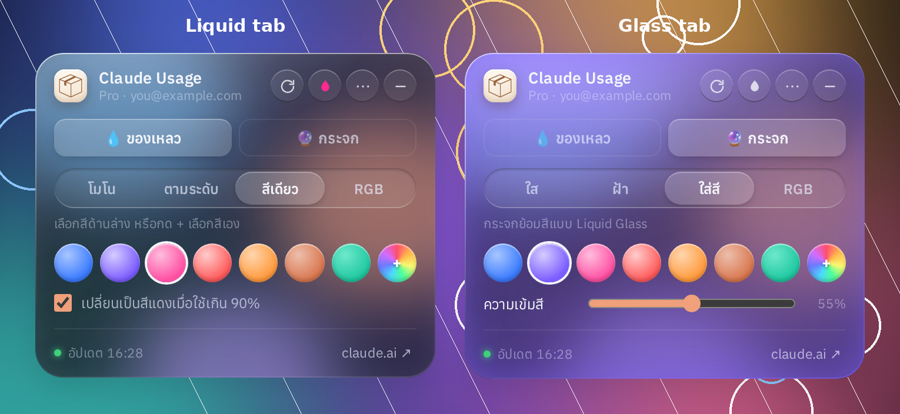
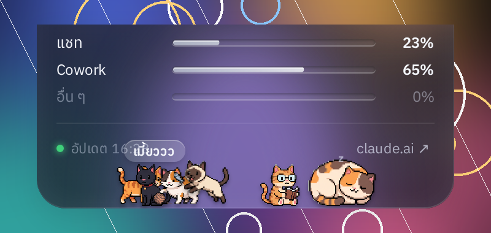
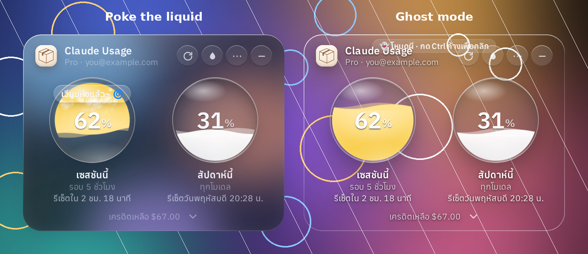

# Claude Usage Widget

A small **Liquid Glass** desktop widget for **Windows** that keeps your **claude.ai plan usage** in view. It shows the 5-hour session, the weekly limit, per-model limits, cloud credits and usage by product, each with a live countdown to its reset.

วิดเจ็ตหน้าจอ Windows ธีม Liquid Glass แสดงการใช้งานแพลน claude.ai แบบเรียลไทม์: เซสชัน 5 ชม., รายสัปดาห์, แยกตามโมเดล, เครดิต และแยกตามผลิตภัณฑ์ พร้อมนับถอยหลังเวลารีเซ็ต



> ⚠️ **Unofficial.** This project is not affiliated with or endorsed by Anthropic. It reads the same data claude.ai shows on its own usage page, through an undocumented endpoint that may change at any time. If it does change, the widget can stop working until it is updated.

---

## Contents

- [Download](#download--ดาวน์โหลด)
- [Sign in](#sign-in--การเข้าสู่ระบบ)
- [What it shows](#what-it-shows--แสดงอะไรบ้าง)
- [Colours: liquid & glass](#colours-liquid--glass--ปรับสี)
- [Staying out of your way](#staying-out-of-your-way--ไม่เกะกะ)
- [Pixel cats](#pixel-cats--น้องแมว)
- [Little extras](#little-extras--ลูกเล่นเล็กๆ)
- [Tray menu & shortcuts](#tray-menu--shortcuts)
- [Performance](#performance)
- [Build from source](#build-from-source)
- [How it works & privacy](#how-it-works--privacy)

---

## Download / ดาวน์โหลด

Get the latest build from **[Releases](../../releases/latest)**:

| File | Use |
|---|---|
| `ClaudeUsageWidget-Setup-x.y.z.exe` | Installer. Adds Start Menu and Desktop shortcuts. |
| `ClaudeUsageWidget-Portable-x.y.z.exe` | Portable build. Runs without installing. |

The builds are not code-signed, so Windows SmartScreen may warn you. Click **More info → Run anyway** to continue.
ไฟล์ยังไม่ได้เซ็นลายเซ็นดิจิทัล ถ้า SmartScreen เตือนให้กด **More info → Run anyway**

**Requirements**

- Windows 10 or 11, 64-bit
- A claude.ai account on a Pro, Max, Team or Enterprise plan
- Windows 11 22H2 or later for the blurred **Frosted** glass. On older versions, choose **Clear** glass instead.

## Sign in / การเข้าสู่ระบบ

1. Click **ล็อกอินด้วยอีเมล** (Sign in with email), then finish the claude.ai sign-in with the code or link it emails you.
   - Google blocks sign-in inside embedded app windows. If your account normally uses Google, enter the same email address instead; that works.
   - If claude.ai sends you a link, right-click it, choose **Copy link**, and paste it into the box at the bottom of the sign-in window.
2. **Alternative:**
   1. Sign in to claude.ai in your normal browser.
   2. Open DevTools (F12) → **Application** → **Cookies** → `https://claude.ai`.
   3. Copy the value of `sessionKey`.
   4. Click **วางจากคลิปบอร์ด** (Paste from clipboard) in the widget.

Your session stays **only on your PC**, in the app's own browser profile.

---

## What it shows / แสดงอะไรบ้าง

| | |
|---|---|
| **Session (5 h)** | Liquid orb showing the 5-hour session %, with a countdown to its reset |
| **Weekly** | Liquid orb showing the 7-day limit %, with its reset day and time |
| **Per-model weekly** | Opus and Sonnet weekly limits, when claude.ai reports them for your plan |
| **Cloud credits** | Claude Code cloud-session credit (`iguana_necktie` in the API), shown as dollars left with the expiry date |
| **Usage by product** | This week's split across Claude Code, Chats, Cowork and Other, read from your claude.ai usage page |
| **Session pace** | A sparkline of the current 5-hour window, your burn rate (%/h), and a forecast such as *"expected full at 15:07"* |

Limits that claude.ai returns under internal codenames that haven't been announced (e.g. `nimbus_quill`) are hidden.

**Collapse / expand.** Click the arrow under the orbs to show or hide the details. The window itself grows and shrinks on a time-based ease curve. It stays anchored to the corner you placed it in, so it never jumps, even when it sits against a screen edge.



**Soft alert.** Above 80% the glass frame breathes slowly in amber, and turns red above 90%. There is no blinking and no pop-ups. You can also get Windows notifications at 80% and 95%, and when your session resets.



---

## Colours: liquid & glass / ปรับสี

The droplet button in the header opens a colour panel. It has two separate tabs, one for the **liquid** and one for the **glass**.

**Liquid**



- **Mono** (default): white or grey to match light/dark mode. It turns yellow → orange → red only as you approach a limit.
- **By level**: blue → amber → red.
- **Single colour**: 7 presets or any custom colour.
- **RGB**: a slow rainbow cycle, with adjustable speed.

**Glass**



- **Clear**: truly clear, with no tint and no blur. Only the rim and highlights remain.
- **Frosted** (default): Windows Acrylic blur.
- **Tinted**: a Liquid Glass-style colour tint with adjustable strength.
- **RGB**: a soft, blurred rainbow light moving *inside* the glass.



---

## Staying out of your way / ไม่เกะกะ

- **Magnetic snap:** drop the widget near a screen edge and it snaps to that edge.
- **Hide in the edge** (optional): when snapped to the left or right edge, it slides away while you're not using it and leaves a thin handle. Touch the handle and it slides back.
- **Ghost mode** (`Ctrl+Alt+G`): the widget becomes click-through, so you can work on whatever is behind it. Hold **Ctrl** to use the widget normally while in ghost mode.
- **Adaptive opacity:** when your mouse is far away, the widget fades to 20%, 30% or 50%, and it comes back as soon as the cursor gets close.
- **Lock position:** prevents accidental dragging.
- **Size:** 75% / 85% / 100% / 115%.
- **Always on top** and **Start with Windows**.

---

## Pixel cats / น้องแมว 🐾



Up to six pixel cats can wander along the bottom of the glass:

- a walker
- a sitter that hops around
- a calico
- a reader
- a sleeper with little *z*s
- a fish-chasing sprinter

Click one and it meows. You can add **your own pet** from any transparent PNG, GIF or WEBP (tray → น้องแมว → เพิ่มน้องจากรูปเอง…).

The cats are built to be cheap. There is no per-frame JavaScript: each cat picks its next move on a timer every few seconds, and all motion is compositor-only CSS transforms. They pause completely while the widget is faded or hidden.

---

## Little extras / ลูกเล่นเล็กๆ



- **Poke the liquid:** click an orb and it sloshes, bubbles and splashes. Poke it a few times fast and see what happens.
- **Smooth values:** numbers and rings glide to each new value instead of jumping on refresh.
- **Tray ring:** the tray icon shows your session % as a small coloured ring.
- **Header icon:** the box, a sparkle, or any image you pick (PNG/JPG/SVG/ICO, up to 2 MB).
- **Fonts:** Anuphan, IBM Plex Sans Thai, Prompt and Noto Sans Thai, all bundled with the app.
- **Light/dark:** follows the Windows theme.
- **Multiple organizations:** switch between them from the tray.

---

## Tray menu & shortcuts

| Shortcut | Action |
|---|---|
| `Ctrl+Alt+C` | Show / hide the widget |
| `Ctrl+Alt+G` | Toggle ghost mode |
| Hold `Ctrl` | Interact with the widget while in ghost mode |

The tray menu has these settings:

- Refresh now, and refresh interval (1 / 2 / 5 / 10 min)
- Collapse / expand
- Snap to edges
- Hide in the edge
- Ghost mode
- Fade when the mouse is far away
- Lock position
- Size
- Always on top
- Start with Windows
- Notifications
- Glass material
- Liquid colour
- Font
- Header icon
- Cats
- Organization
- Reduce animations
- Reset position
- Open claude.ai usage page
- Sign out

---

## Performance

- **Compositor-only animation.** Every ambient animation uses only `transform` and `opacity`, so it never repaints. In testing, idle repaints dropped from about 360/s to almost 0, and main-thread time from about 6.5% to about 0.1%.
- **Pause when not visible.** Animations stop while the widget is faded, hidden or in the edge.
- **Reduce animations** (tray) stops the waves and glow completely, for the lowest CPU and GPU use.
- **Light network use.** The per-product page is read at most every 10 minutes.

---

## Build from source

```bash
npm install
npm start          # run in development
npm run dist       # build installer + portable exe into dist/
```

Pushing a tag like `v2.4.1` makes GitHub Actions (`.github/workflows/release.yml`) build both `.exe` files on Windows and attach them to a new Release.

```
src/
  main.js        Electron main: window, tray, data fetch, snap/edge/ghost, animation
  preload.js     safe bridge (window.widget)
  index.html     widget markup
  style.css      Liquid Glass styles
  renderer.js    rendering, colour panel, collapse, poke gimmick
  pets.js        pixel cat engine
  cats/          cat sprites
  fonts/         bundled Thai fonts (OFL)
```

## How it works & privacy

- Built with **Electron**. The window is frameless and uses Windows 11's `backgroundMaterial` for the real desktop blur. CSS adds the tint, rim light, highlights and the liquid gauges.
- Usage data comes from a hidden `claude.ai` page that uses your signed-in session:
  - `GET /api/organizations`
  - `GET /api/organizations/{id}/usage`
- The per-product breakdown has no API. The widget reads the "usage by product" section from `claude.ai/settings/usage` in a hidden window.
- Nothing is sent anywhere except `claude.ai`. Settings and session history are stored locally in your user profile.

## Credits & licence

- Code: **MIT** © Pack
- Fonts: Anuphan, IBM Plex Sans Thai, Prompt and Noto Sans Thai, via [Fontsource](https://fontsource.org), under the SIL Open Font License 1.1 (licence files are in `src/fonts/`).
- "Claude" is a trademark of Anthropic. This project only displays your own account data and is not an Anthropic product.
