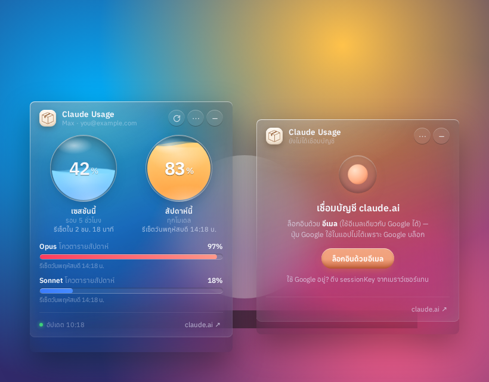
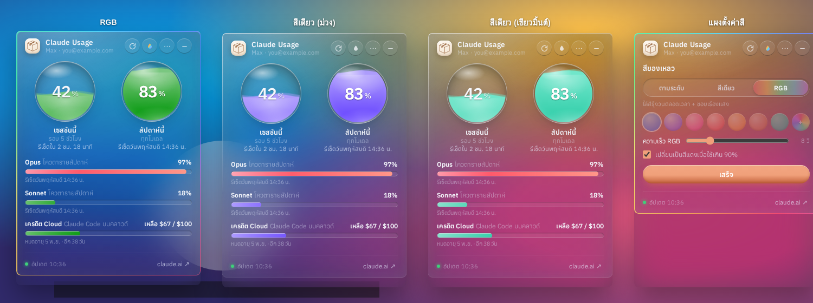
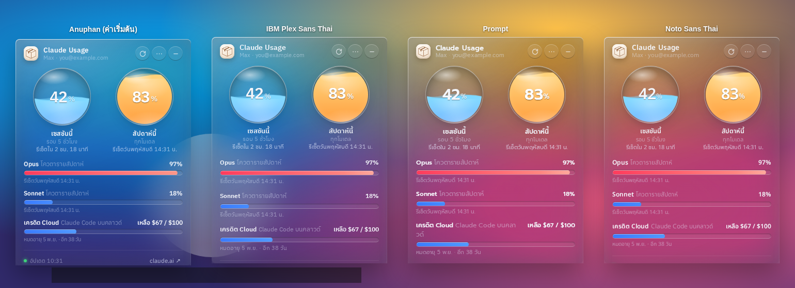

# Claude Usage Widget

A small **Liquid Glass** desktop widget for **Windows** that shows your **claude.ai plan usage**: the 5-hour session limit, the weekly limit, and per-model weekly limits when your plan has them. It shows how much of each you've used and when each one resets.

วิดเจ็ตหน้าจอสำหรับ Windows ธีม Liquid Glass แสดง % การใช้งานแพลน claude.ai (เซสชัน 5 ชม. / รายสัปดาห์) พร้อมเวลารีเซ็ต



> ⚠️ **Unofficial.** This project is not affiliated with or endorsed by Anthropic. It reads the same usage data that claude.ai shows on its own settings page, through an undocumented endpoint. That endpoint may change at any time, and if it does, the widget can stop working.

---

## Download / ดาวน์โหลด

Get the latest build from **[Releases](../../releases/latest)**:

| File | Use |
|---|---|
| `ClaudeUsageWidget-Setup-x.y.z.exe` | Installer. Adds Start Menu and Desktop shortcuts. |
| `ClaudeUsageWidget-Portable-x.y.z.exe` | Portable build. Runs without installing. |

The builds are not code-signed, so Windows SmartScreen may show a warning. To continue, click **More info → Run anyway**.

ไฟล์ยังไม่ได้เซ็นลายเซ็นดิจิทัล ถ้า SmartScreen เตือนให้กด **More info → Run anyway**

## Requirements

- Windows 10 or 11 (64-bit)
- A claude.ai account on a Pro, Max, Team or Enterprise plan
- For the blurred **Acrylic** glass effect: Windows 11 22H2 or later. On older systems, choose **Clear Glass** from the tray menu.

## Sign in / การเข้าสู่ระบบ

1. Click **ล็อกอินด้วยอีเมล** (Sign in with email). Enter your email and complete the claude.ai sign-in with the code or link it sends you.
   - Google blocks sign-in inside embedded app windows, so the Google button will not work here. If your account uses Google sign-in, enter the same email address instead; this works.
   - If claude.ai emails you a link, right-click it, choose **Copy link**, and paste it into the box shown at the bottom of the sign-in window.
2. **Alternative:** Sign in to claude.ai in your normal browser. Then open DevTools (F12) → **Application** → **Cookies** → `https://claude.ai`, copy the value of `sessionKey`, and click **วางจากคลิปบอร์ด** (Paste from clipboard) in the widget.

Your session is stored **only on your PC**, in the app's own browser profile. It is never sent anywhere except `claude.ai`.

## Features

- Liquid-glass orbs whose fill level shows usage. The colour changes from blue to amber to red as you get close to a limit.
- A countdown to each reset, in Thai.
- Per-model weekly limits (Opus, Sonnet) appear only when claude.ai reports them for your plan. Pro accounts usually get just the session and weekly limits.
- Claude Code cloud-session credits (the `iguana_necktie` field in the API) are shown as dollars remaining, with the expiry date.
- Other limits that claude.ai returns under internal codenames (e.g. `nimbus_quill`) are hidden by default. You can show them from the tray menu.
- Tray menu with these settings:
  - Always on top
  - Start with Windows
  - Refresh interval (1, 2, 5 or 10 min)
  - Notifications at 80% and 95%
  - Glass material: Acrylic, Mica or Clear
  - Font: Anuphan, IBM Plex Sans Thai, Prompt or Noto Sans Thai, all bundled with the app
  - Organization switcher, if you belong to more than one
- Liquid colour modes, set from the droplet button in the header:
  - **ตามระดับ (By level):** blue → amber → red as usage rises (default)
  - **สีเดียว (Single colour):** 7 presets, or pick any colour
  - **RGB:** a rainbow cycle with a glowing rim, at an adjustable speed
  - An optional red warning above 90% usage, in any mode
- Follows the Windows light/dark theme.
- Remembers where you placed it on screen.





## Build from source

```bash
npm install
npm start          # run in development
npm run dist       # build installer + portable exe into dist/
```

Pushing a tag like `v1.2.0` makes GitHub Actions (`.github/workflows/release.yml`) build both `.exe` files on Windows and attach them to a new Release.

## How it works

- Built with Electron. The widget window is frameless and uses Windows 11's `backgroundMaterial` (Acrylic or Mica) for the real desktop blur. CSS then adds the tint, rim light, specular sheen and the liquid gauges.
- Usage data is fetched from inside a hidden `claude.ai` page that uses your signed-in session:
  - `GET /api/organizations`
  - `GET /api/organizations/{id}/usage`
- Only known limit types are shown. Internal codename fields are ignored.

## Fonts

The bundled fonts are Anuphan, IBM Plex Sans Thai, Prompt and Noto Sans Thai, taken from [Fontsource](https://fontsource.org). All four are licensed under the SIL Open Font License 1.1.

## License

MIT © Pack
